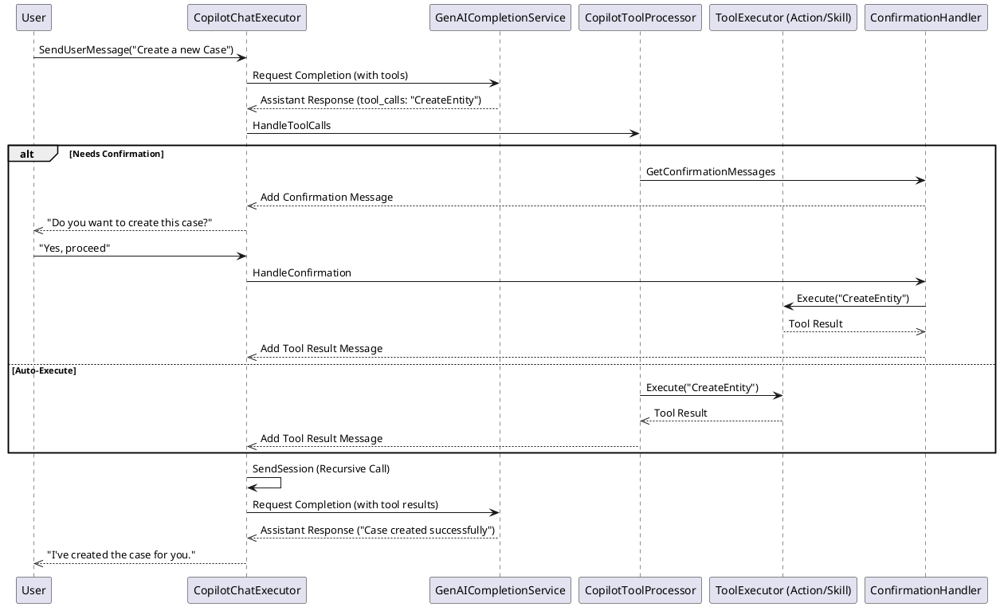
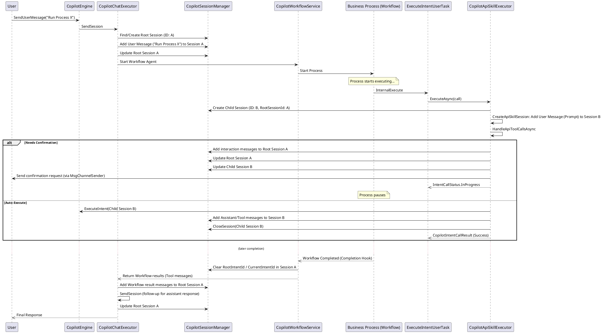

# Copilot Session Lifecycle

This document describes the lifecycle of a `CopilotSession` in Creatio Copilot, covering its creation, management, persistence, and hierarchical relationships.

---

## 1. Overview

A `CopilotSession` is the primary container for conversation state, including message history, active intents, and context. It exists in three main states:
1.  **In-Memory (Active)**: Hosted in the `CopilotSessionManager`'s static cache for fast access during a conversation.
2.  **Persistent (Storage)**: Saved in the database via `CopilotHistoryStorage` for long-term history and session restoration.
3.  **Transient**: Short-lived sessions (e.g., for certain API calls) that are not persisted to the database.

---

## 2. Lifecycle States and Transitions

### 2.1 Creation
Sessions are created via `ICopilotSessionManager.CreateSession`.

-   **Chat Session**: Triggered by `CopilotChatExecutor.SendSession` when no `copilotSessionId` is provided or found.
-   **API Session**: Triggered by `CopilotApiSkillExecutor` for standalone skill execution.
-   **Initial State**: Upon creation, a session is assigned a `SystemPrompt` based on its type and added to the `CopilotSessionManager`'s active collection.

### 2.2 Active Management (In-Memory)
-   **Storage**: Active sessions are stored in a static `ConcurrentDictionary` within `CopilotSessionManager`.
-   **Retrieval**: `FindById` first checks the in-memory collection. If not found, it attempts to load the session from `CopilotHistoryStorage` (DB).
-   **Expiration**: `UnloadOldSessions` periodically removes inactive sessions from memory to free up resources.

### 2.3 Persistence (Database & Processing)
Persistence happens in two stages after a message cycle:

1.  **Immediate Save**: `CopilotHistoryStorage.SaveSession` writes the session and its messages to the `CopilotSession` and `CopilotMessage` tables.
2.  **Dispatched Processing**: `CopilotSessionResponseDispatcher` executes background handlers:
    -   `CopilotSessionMessageSummarizer`: Summarizes history if the message count exceeds limits.
    -   `CopilotSessionTitleUpdater`: Generate a session title based on the first few messages.

### 2.4 Termination
-   **Closing**: `CloseSession` marks the session as closed and removes it from the active collection. For child sessions, this typically happens after skill execution completes.
-   **Cleanup**: During workflow completion or cancellation, the `WorkflowCompletionHook` clears `RootIntentId` and `CurrentIntentId` in the root session to signal the end of the agentic scenario.
-   **Deletion**: `RemoveInDataStore` deletes the session from the database.

---

## 3. Message Addition to Sessions

Adding messages is the primary way a session's state evolves. This happens at specific points in the lifecycle and differs between Root and Child sessions.

### 3.1 Root Session (Chat)

Messages are added to the Root Session during the multi-turn chat flow orchestrated by `CopilotChatExecutor`. This includes both standard conversation and LLM-driven function calling.

| Lifecycle Stage | Method | Message Type | Description |
| :--- | :--- | :--- | :--- |
| **User Input** | `SendSession` | `User` | The initial message from the user is added immediately upon receipt. |
| **Agent Trigger** | `TriggerExecution` | `System` / `Tool` | If an agent is triggered (e.g., "Open Case Agent"), system instructions or tool results may be added. |
| **LLM Response (Text)** | `HandleCompletionResponse` | `Assistant` | Text generated by the LLM is added after receiving the completion. |
| **Tool Calling** | `ExecuteToolCalls` | `Assistant` (ToolCall) | If the LLM decides to use a tool, an Assistant message containing the `tool_calls` is added. |
| **Tool Execution** | `HandleToolCalls` | `Tool` | The output of a skill or action execution is added as a Tool message. |
| **Pending Interaction**| `SendUserConfirmationToChat` | `Assistant` (Confirmation / Clarification) | Added by `CopilotApiSkillExecutor` to the Root Session when an API tool requires user input. |
| **Confirmation** | `HandleConfirmation` | `Assistant` (Confirmation) | If an action requires approval, a special confirmation message is added. |

### 3.2 Child Session (API/Nested)

Child sessions are used for isolated intent execution, often within a workflow. They follow a more linear "Execute -> Complete" pattern.

| Lifecycle Stage | Method | Message Type | Description |
| :--- | :--- | :--- | :--- |
| **Initialization** | `CreateApiSkillSession` | `User` | A "synthetic" User message is created containing the generated prompt with all parameters. |
| **Execution** | `HandleApiToolCallsAsync` | `Assistant` / `Tool` | Messages are added to the Child Session during tool execution. If interaction is needed, `IntentCallStatus.InProgress` is returned. |
| **Interaction** | `HandleConfirmationToolCalls` | `Assistant` / `Tool` | When a process resumes, the user response and resulting tool messages are added to the Child Session. |
| **Resumption** | `CompleteExecutingIntentAsync` | `User` / `Tool` | When a process element resumes, the user's response is retrieved from the root session and added to the child session to resume LLM interaction. |
| **Result Mapping** | `MapSkillResponse` | `Assistant` | The final text response from the LLM is added before the session returns to the caller. |
| **User Interaction** | `EnrichToolCallByToolUserMessage` | `Tool` | If a child session requires user input (clarification), the user's response is eventually added to the child session. |

---

## 4. LLM-Driven Function Calling Lifecycle (Tools)

Unlike the workflow-driven lifecycle, the LLM-driven lifecycle is reactive and iterative. The LLM determines which tools to call based on the user's intent and the available tool context.

### 4.1 The Function Calling Loop

1.  **Context Building**: `CopilotToolContextBuilder` identifies available tools (intents/actions).
2.  **LLM Decision**: The LLM returns a response containing `tool_calls`.
3.  **Execution**: `CopilotToolProcessor` iterates through the calls, invoking the corresponding `IToolExecutor`.
4.  **Feedback**: Tool results are added to the session as `Tool` messages.
5.  **Iteration**: `CopilotChatExecutor` calls `SendSession` recursively with the tool results until the LLM provides a final text response.

### 4.2 Handling Confirmations (Breakpoints)

When a tool requires confirmation (e.g., `IsConfirmationRequired = true`):
1.  `CopilotToolProcessor` skips immediate execution.
2.  `CopilotMessageConfirmationHandler` generates a `Confirmation` message.
3.  The flow pauses and returns to the user.
4.  The user's response is intercepted by `HandleConfirmation`, which then executes the approved tool calls.

### 4.3 Diagram: LLM-Driven Tool Execution

---

## 5. Session Hierarchy (Root and Child)

Copilot supports nested execution, where one session can trigger another. This is common in **Workflow Agent** scenarios.

### 5.1 Root Session
The top-level session (usually a `Chat` session) where the user interaction began. It maintains the overall conversation history.

### 5.2 Child (Nested) Session
Created when a business process (running as a Workflow Agent) executes an intent via the `ExecuteIntentUserTask`.

-   **Relation**: The child session's `RootSessionId` property points to the ID of the parent session.
-   **Boundary**: `RootSessionHistoryBoundaryTicks` tracks the point in the Root session's history when the Child session was created.
-   **History Inheritance**: When calling the LLM for a Child session, `GetMessagesMergedWithRootMessages` prepends the Root session's history (up to the boundary) to the Child session's messages if `UseChatHistory` is enabled for the intent.
-   **Context Inheritance**: If `UsePageContext` is enabled, the Child session uses the context (record ID, schema) from the Root session.

---

## 6. Workflow Scenario: Investigating the Lifecycle

### 6.1 Diagram: Workflow Agent Session Flow

For a more detailed breakdown of the message flow during workflow execution, see [SendUserMessage: Workflow Scenario Flow](./SEND_USER_MESSAGE_WORKFLOW_FLOW.md).

---

## 7. Summary Table: Where is Session Data?

| Component | Storage Type | Data Kept | Purpose |
| :--- | :--- | :--- | :--- |
| `CopilotSessionManager` | Static Cache | `CopilotSession` Objects | Fast access for active chats. |
| `DataStore` (Redis) | Key-Value | Session Meta-info | State synchronization across nodes. |
| `CopilotHistoryStorage` | Database | Sessions & Messages | Long-term history and audit. |
| `CopilotSession` table | DB Row | `Id`, `UserId`, `State`, `RootSessionId` | Session header information. |
| `CopilotMessage` table | DB Rows | `Content`, `Role`, `IntentId`, `ToolCalls` | Actual conversation content. |
