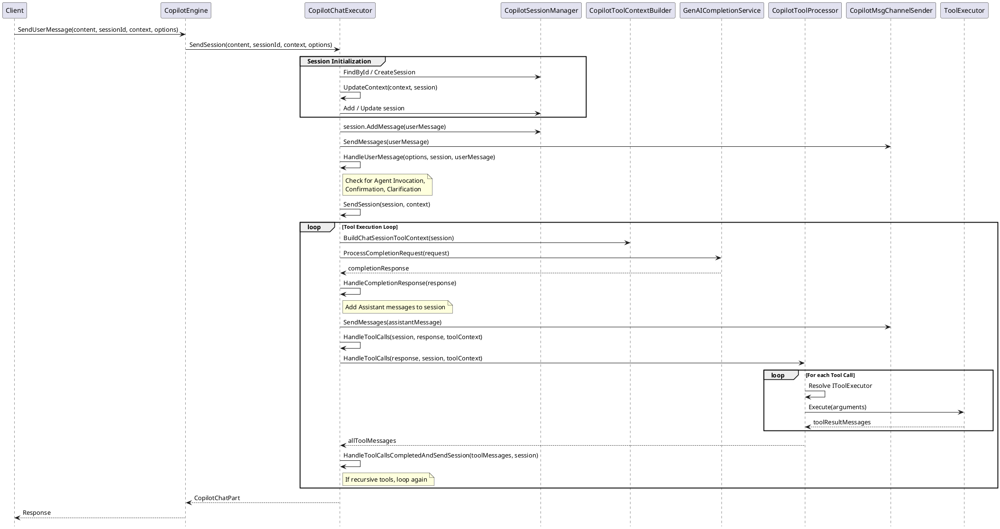

# SendUserMessage Detailed Execution Flow

This document provides an in-depth explanation of the `SendUserMessage` flow in Creatio Copilot, from the initial user request to the final assistant response, including session context management and message ordering.

---

## 1. High-Level Overview

The `SendUserMessage` flow is the core interaction loop for the Copilot Chat. It handles:
1. Receiving user input.
2. Managing the conversation session (state and history).
3. Orchestrating tool execution (Skills, Actions, Workflows).
4. Communicating with the LLM.
5. Returning the response to the client via WebSockets.

---

## 2. Sequence Diagram



---

## 3. Session Context Management

The `CopilotSession` object is the source of truth for the conversation state.

### 3.1 Messages Order and Storage
Messages are stored in the `_messages` list within `CopilotSession`. The order is strictly chronological:
1. **User Message**: Added first when `SendUserMessage` is called.
2. **System Message (Dynamic)**: Added during completion request building (e.g., Agents description, Page context).
3. **Assistant Message**: Added when the LLM returns a text response.
4. **Tool Call (Assistant Role)**: Added when the LLM decides to call a tool.
5. **Tool Response (Tool Role)**: Added after a tool is executed.

### 3.2 Message Persistence
- `session.AddMessage(message)`: Adds a message and sets its `IntentId` and `RootIntentId` based on the current session state.
- `session.GetMergedMessages()`: Used when sending history to the LLM. It replaces individual messages with their summarized versions if they have been summarized.
- `session.CleanToolCallsWithoutTools()`: A cleanup routine that ensures consistency by removing tool calls that don't have a corresponding response.

### 3.3 Session State Fields
- `CurrentIntentId`: The ID of the skill or agent currently being executed.
- `RootIntentId`: The ID of the top-level agent (if any) that orchestrates the conversation.
- `BoundedIntentId`: If set, the session is locked to a specific agent.

---

## 4. Where Inserts and Deletes Occur

### 4.1 Insertions
- **User Input**: In `CopilotChatExecutor.SendSession`, the `userMessage` is added to the session immediately.
- **LLM Responses**: In `HandleCompletionResponse`, assistant messages are added.
- **Tool Results**: In `HandleToolCallsCompleted`, tool response messages are added.
- **System Prompts**: In `CreateCompletionMessages`, temporary system messages are injected into the list sent to the LLM (but not necessarily stored in the permanent database history).

### 4.2 Deletions / Modifications
- **Truncation**: `GetMessagesToSend` filters out messages that are `IsSentToClient`, `IsFromSystemPrompt`, or `TruncateOnSave`.
- **Summarization**: Older messages aren't deleted but are effectively "replaced" in the LLM context by `GetMergedMessages` when a summary exists.
- **Confirmation/Clarification**: `RemoveLastUserMessage` and `RemoveLastClarificationMessage` are used in specific error-recovery or retry scenarios.
- **Tool Call Cleanup**: In `CreateToolCallMessages`, when a tool result is processed, the old "temporary" tool call messages (often used for progress tracking) are removed and replaced with the final results.

---

## 5. Message Roles in the Flow

| Role | Source | Purpose |
| :--- | :--- | :--- |
| `User` | Client | User's prompt/question. |
| `Assistant` | LLM | Text response or a decision to call a tool. |
| `Tool` | Tool Executor | The output of a Skill, Action, or Workflow. |
| `System` | Copilot Logic | Instructions, context, and tool definitions. |

---

## 6. Detailed Flow Steps

1. **Permission Check**: `CheckCanExecuteOperation("CanRunCreatioAI")`.
2. **Session Retrieval**: `_sessionManager.FindById` or `CreateSession`.
3. **Context Update**: `UpdateContext` applies `CopilotContext` (e.g., current record, page schema) to the session.
4. **User Message Handling**:
    - `HandleUserMessage` checks if the message triggers a specific agent (e.g., "Open Agent X").
    - If a workflow is executing, it might route the message to the workflow instead of the LLM.
5. **Tool Context Building**: `BuildChatSessionToolContext` gathers all available Agents, Skills, and Actions based on the `RootIntentId`.
6. **LLM Request**: `CreateCompletionRequest` combines message history, system prompts, and tool definitions.
7. **LLM Response Processing**:
    - If the LLM returns text, it's sent to the client.
    - If it returns `tool_calls`, the `CopilotToolProcessor` takes over.
8. **Tool Execution**:
    - Executors (Intent, Action, or Workflow) run the logic.
    - Results are added back to the session.
    - If the tool result requires an assistant follow-up (most do), `SendSession` is called recursively.
    - For Workflow Agents, see the detailed [Workflow Scenario Flow](./SEND_USER_MESSAGE_WORKFLOW_FLOW.md).
9. **Progress Notification**: Throughout the flow, `SendSessionProgress` updates the UI (e.g., "Copilot is thinking...", "Executing Action...").
10. **Final Dispatch**: `_sessionDispatcher.DispatchAsync` saves the session state to the database.

---

## 7. Handling Tool Call Confirmation

Some actions (e.g., deleting a record, sending an email) may require explicit user confirmation before execution. This process splits the tool execution into two distinct phases.

### 7.1 Phase 1: Confirmation Request
During the `HandleToolCalls` step, if a tool (usually an `Action`) has `IsConfirmationRequired = true`:

1.  **Skip Execution**: `CopilotToolProcessor` skips the immediate execution of the tool.
2.  **Generate Confirmation Message**: `CopilotMessageConfirmationHandler.GetConfirmationMessages` is called.
3.  **Add to Session**: A new `CopilotMessage` is created with:
    - `Role = Assistant`
    - `ContentType = Confirmation` (via `IsPendingConfirmation` check)
    - `ToolCallIdsRequireConfirmation`: List of tool call IDs waiting for approval.
    - `Content`: A structured JSON (generated by `ICopilotConfirmationMessageGenerator`) describing the action to be confirmed.
4.  **Send to Client**: The confirmation message is sent to the UI, which typically displays "Approve" and "Reject" buttons.
5.  **Wait**: The flow completes without executing the tool, waiting for the next user message.

### 7.2 Phase 2: Confirmation Response
When the user clicks "Approve" or "Reject", a new `SendUserMessage` request is sent with the user's choice.

1.  **Intercept User Message**: `CopilotChatExecutor.HandleUserMessage` calls `TryHandleConfirmationToolCalls` before calling the LLM.
2.  **Validate Pending State**: It checks if the session has any messages where `IsPendingConfirmation()` is true.
3.  **Process Response**: `CopilotMessageConfirmationHandler.HandleConfirmation` takes over:
    - It finds the last pending confirmation message.
    - It determines if the user's response is an approval or rejection.
    - It marks the `ToolCall.ConfirmationResult` as `Approve` or `Reject`.
4.  **Execute Approved Tools**: If approved, `ExecuteToolCallsIfNeed` finally runs the tool's logic.
5.  **Continue Flow**: The resulting tool messages are added to the session, and `SendSession` is called to let the LLM react to the tool's output.

### 7.3 Example: Confirmation Message (Internal Representation)

```json
{
  "Role": "Assistant",
  "ContentType": "Confirmation",
  "Content": "{ \"Actions\": [{ \"ActionName\": \"DeleteEntity\", \"Parameters\": { \"EntityId\": \"...\" } }] }",
  "ToolCallIdsRequireConfirmation": ["call_abc123"]
}
```

---

## 8. Summary of Workflow vs. LLM Flow in Confirmation

-   **LLM-driven Confirmation**: Handled by `CopilotMessageConfirmationHandler`. It uses the message history and `Confirmation` content type.
-   **Workflow-driven Confirmation**: Handled by `CopilotWorkflowService.HandleConfirmation`. It often relies on `ProcessElementId` to resume a specific task in a business process.
