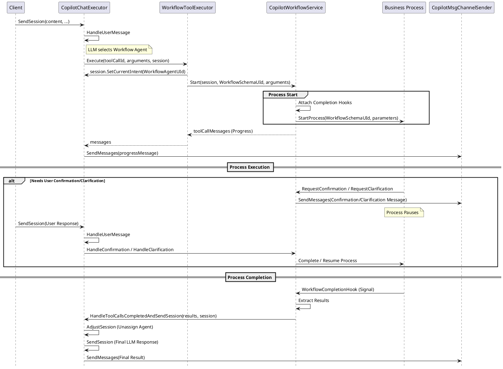

# SendUserMessage: Workflow Scenario Flow

This document provides a detailed explanation of the `SendUserMessage` flow when interacting with a **Workflow Agent**. It covers how business processes are triggered, managed, and how they interact with the chat session.

---

## 1. High-Level Overview

When a user's message triggers a Workflow Agent, the execution shifts from a pure LLM-driven flow to a **Process-driven flow**. 

1.  **Trigger**: The LLM identifies that a Workflow Agent (Intent Type: `WorkflowAgent`) should be executed.
2.  **Orchestration**: `WorkflowToolExecutor` starts the associated Creatio Business Process.
3.  **Interaction**: The process may require user input (Confirmation or Clarification), pausing execution until the user responds.
4.  **Nested AI**: The process can invoke other AI skills using the `ExecuteIntentUserTask`.
5.  **Completion**: Once the process finishes, a completion hook returns the results to the chat session, and the agent is unassigned.

---

## 2. Sequence Diagram: Workflow Agent Flow

---

## 3. Detailed Execution Stages

### 3.1 Initiation (Triggering the Agent)
When the LLM decides to call a tool that maps to a `WorkflowAgent`, the `WorkflowToolExecutor` is invoked.
-   It updates the session state: `session.RootIntentId = WorkflowAgentUId`.
-   It calls `_workflowService.Start()`, which initiates the Creatio Business Process.
-   The initial response to the user is usually a progress message indicating the process has started.

### 3.2 Process-Chat Interaction (Breakpoints)
Unlike standard tools, a Workflow Agent can pause and wait for the user.

#### 3.2.1 Confirmation
If the process reaches a point requiring approval (e.g., "Confirm order?"):
1.  The process sends a confirmation request.
2.  `CopilotWorkflowService` adds a `Confirmation` content-type message to the session.
3.  The chat flow stops and waits.
4.  When the user responds ("Yes" or "No"), `CopilotChatExecutor.HandleUserMessage` detects the `workflowExecuting` state and routes the message to `_workflowService.HandleConfirmation`.
5.  The service calls `_processExecutor.CompleteProcess`, signaling the Process Engine to resume.

See the [Workflow Confirmation & Clarification Flow](./WORKFLOW_CONFIRMATION_FLOW.md) for more details.

#### 3.2.2 Clarification
If the process needs more data (e.g., "What is the delivery date?"):
1.  Similar to confirmation, but using the `Clarification` content-type.
2.  The user's text response is passed back to the process parameter via `CompleteProcess`.

### 3.3 Resumption Flow: From Process to AI Skill
When a process element like `ExecuteIntentUserTask` is resumed via `CompleteProcess`, it triggers a specific completion sequence:

1.  **Process Engine Signal**: `CompleteProcess` calls `ProcessEngine.CompleteExecuting(processElementId, userMessage)`.
2.  **Element Resumption**: The waiting `ExecuteIntentUserTask` instance is activated and its `CompleteExecuting` method is called.
3.  **Copilot Engine Callback**: `ExecuteIntentUserTask` calls `CopilotEngine.CompleteExecutingIntentAsync(session)`.
4.  **Skill Completion**:
    - `CopilotApiSkillExecutor` retrieves the User's response from the Root Session.
    - It "enriches" the Child Session history with the new input (via `HandleConfirmationToolCalls` or `EnrichToolCallByToolUserMessage`).
    - It calls `ExecuteIntentAsync` to get a final response from the LLM based on the updated context.
    - The Child Session is closed.
5.  **Process Continuation**: The `ExecuteIntentUserTask` receives the result, maps output parameters, and returns `true`, allowing the business process to move to the next element.

### 3.4 Nested Intent Execution
A Business Process can call other AI skills via the **"Call Copilot" (`ExecuteIntentUserTask`)** element.
-   This creates a **Child Session**.
-   The Child Session inherits context (record ID) and history from the Root Session if configured.
-   The result of the AI skill is mapped back to process variables to influence subsequent logic.

### 3.5 Completion and Teardown
When the process reaches its end state (Completed, Failed, or Cancelled):
1.  The `WorkflowCompletionHook` (attached during Start) is triggered.
2.  It converts process output parameters into `CopilotMessage` objects (Role: `Tool`).
3.  It calls `HandleToolCallsCompletedAndSendSession`.
4.  **Important**: The `RootIntentId` is cleared (unassigned) from the session, allowing the LLM to take control again or for the user to select a different agent.
5.  The LLM generates a final natural language response based on the workflow's output.

---

## 4. Session State during Workflow

| Field | During Execution | After Completion |
| :--- | :--- | :--- |
| `CurrentIntentId` | Workflow Agent UId | `null` (or next skill) |
| `RootIntentId` | Workflow Agent UId | `null` |
| `ProcessElementId` | Active Task UId | `null` |

---

## 5. Comparison: LLM-Driven vs. Workflow-Driven

| Feature | LLM-Driven (Standard Skill) | Workflow-Driven (Workflow Agent) |
| :--- | :--- | :--- |
| **Control** | LLM decides next steps. | Business Process logic defines steps. |
| **Duration** | Usually short, atomic. | Can be long-running, multi-step. |
| **State** | Stateless between turns (except history). | Maintains process state/variables. |
| **Complexity** | Best for data retrieval/simple tasks. | Best for complex business logic/approvals. |
