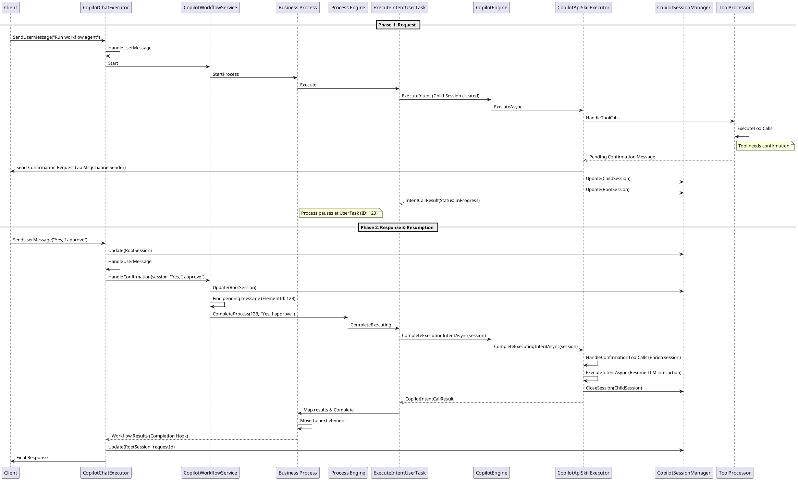

# Workflow Confirmation and Clarification Flow

This document details how Creatio Copilot handles user interaction breakpoints (confirmations and clarifications) within a Workflow Agent scenario.

---

## 1. Overview

In workflow-driven scenarios, the business process itself might require user input or approval before proceeding with a task. Unlike the LLM-driven confirmation flow, which is managed by the `CopilotMessageConfirmationHandler`, the workflow confirmation flow is managed by the `CopilotWorkflowService` and uses the business process engine to resume execution.

---

## 2. Interaction Types

There are two primary types of interaction breakpoints in a workflow:

1.  **Confirmation**: The process pauses to ask the user for approval (e.g., "Do you want to apply these changes?").
2.  **Clarification**: The process pauses to ask the user for more information (e.g., "What is the budget for this project?").

---

## 3. The Execution Phases

### 3.1 Phase 1: Requesting Interaction (User Message -> BP -> User Task)

When a user sends a message that triggers or continues a workflow:

1.  **User Message Received**: `CopilotChatExecutor.SendSession` receives the user message and calls `HandleUserMessage`.
2.  **Workflow Trigger/Execution**:
    -   If it's a new workflow agent: `WorkflowToolExecutor.TriggerExecution` is called, which starts the process via `CopilotWorkflowService.Start`.
    -   If a workflow is already executing: The executor might be waiting for user input (Phase 2) or the process might be running asynchronously.
3.  **Process Execution**: The Business Process (BP) starts/resumes and reaches an `ExecuteIntentUserTask`.
4.  **Tool Execution**: The `ExecuteIntentUserTask` invokes `CopilotEngine.ExecuteIntentAsync`, which calls `CopilotApiSkillExecutor.ExecuteAsync`. During execution, `HandleApiToolCallsAsync` calls `_toolProcessor.HandleToolCalls` to process LLM tool calls.
5.  **Interaction Detection**: If a tool requires confirmation (based on `UseActionConfirmations` feature or explicit metadata), `CopilotToolProcessor` (via `CopilotMessageConfirmationHandler`) adds a `CopilotMessage` to the session with a specific content type:
    -   `ContentType = Confirmation` for approvals.
    -   `ContentType = Clarification` for data input.
6.  **Set ProcessElementId**: The message **MUST** include the `ProcessElementId` of the waiting process element. This is handled by `CopilotApiSkillExecutor.PrepareMessagesBeforeSend`.
7.  **Send to Client**: `CopilotApiSkillExecutor.SendUserConfirmationToChat` sends the message directly to the client via `ICopilotMsgChannelSender`.
8.  **Update Sessions and Set InProgress**:
    -   The `CopilotApiSkillExecutor` adds the pending interaction messages to the **Root Session**.
    -   It updates both the Child and Root sessions via `_sessionManager.Update(session, null)`.
    -   `intentResponse.Status` is set to `IntentCallStatus.InProgress`.
9.  **Flow Pauses**: The `ExecuteIntentUserTask` receives the `InProgress` status and returns `false` in `InternalExecute`, causing the business process to enter a "Waiting" state at that element.

### 3.2 Phase 2: Handling Response (User -> Process)

When the user responds to the request:

1.  **Intercept Message**: `CopilotChatExecutor.HandleUserMessage` identifies that a workflow is executing (`IsWorkflowExecuting`) and that there is a pending confirmation/clarification in the session.
2.  **Route to Workflow Service**:
    -   If a confirmation is pending: `CopilotWorkflowService.HandleConfirmation` is called.
    -   If a clarification is pending: `CopilotWorkflowService.HandleClarification` is called.
3.  **Update Session before Resumption**: The `CopilotWorkflowService` calls `_sessionManager.Update(session, null)` to persist the user's response in the session before completing the process.
4.  **Complete Process Element**:
    -   The service retrieves the `ProcessElementId` from the pending message.
    -   It calls `_processExecutor.CompleteProcess(processElementId, userMessage)`.
5.  **Workflow Resumes**: The business process engine receives the completion signal and resumes the specific process element. In the case of an `ExecuteIntentUserTask`, this triggers its `CompleteExecuting` method.
6.  **Skill Completion**: `ExecuteIntentUserTask` calls `CopilotEngine.CompleteExecutingIntentAsync(session)`, which:
    -   Retrieves the user's response from the Root Session.
    -   Integrates the response into the Child Session context.
    -   Resumes the AI Skill execution to get the final result.
7.  **LLM Follow-up**: Once the business process completes or the AI skill returns, the results are typically fed back into the chat session, and the LLM is invoked to provide a natural language response to the user. `CopilotChatExecutor` finally updates the session via `_sessionManager.Update(session, requestId)`.

## 4. Sequence Diagram: Workflow Confirmation & Resumption

---

## 5. Key Implementation Details

### 5.1 ProcessElementId Mapping

The `ProcessElementId` is the "glue" between the Copilot message and the business process state. 

-   **Confirmation**: `CopilotWorkflowService.HandleConfirmation` looks for the first message where `CopilotExtensions.IsPendingConfirmation` is true and extracts its `ProcessElementId`.
-   **Clarification**: `CopilotWorkflowService.HandleClarification` looks for the last message where `IsPendingClarification()` is true.

Before calling `_processExecutor.CompleteProcess`, the service calls `_sessionManager.Update(session, null)` to ensure the session state is persisted.

### 5.2 Method Comparison

| Feature | `HandleConfirmation` | `HandleClarification` |
| :--- | :--- | :--- |
| **Trigger** | User clicking "Approve/Reject" or typing response. | User providing text input. |
| **Message Selection** | First pending confirmation. | Last pending clarification. |
| **Session State** | Marks confirmation results on tools (if applicable). | Updates `message.ConfirmationResult` with user input. |
| **Resumption** | Completes process via `_processExecutor.CompleteProcess`. | Completes process via `_processExecutor.CompleteProcess`. |

### 5.3 Session Management
When an API skill execution finishes (either in `ExecuteAsync` or `CompleteExecutingIntentAsync`), the `CopilotApiSkillExecutor` explicitly calls `_sessionManager.CloseSession(session, requestId)`. This ensures that the Child Session used for the skill is properly finalized and its state is persisted.

---

## 6. Summary of Responsibilities

-   **Business Process**: Responsible for defining the logic, adding the pending message with `ProcessElementId`, and waiting for completion.
-   **CopilotChatExecutor**: Responsible for detecting the pending state and routing the user message to the appropriate service.
-   **CopilotWorkflowService**: Responsible for bridged communication between the Copilot session and the Process Engine to resume the specific waiting element.
